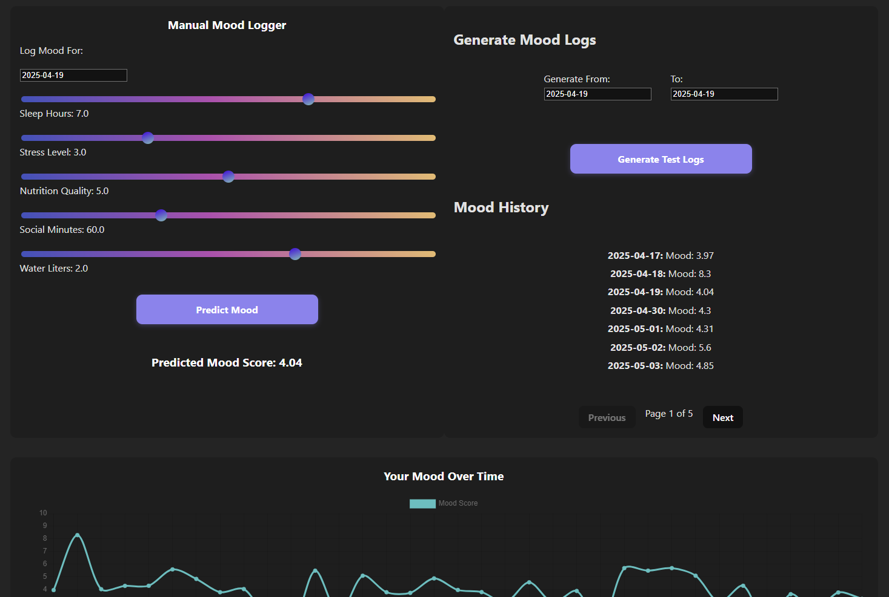

# Mood Predictor – Frontend

An interactive web app built with **Vue 3**, **Vite**, and **manual CSS** that predicts your mood based on your daily lifestyle inputs.

[Backend Repo (FastAPI + ML Model)](https://github.com/lukitasxue/backend_moodPredPage)

[Give it a try! (Mood predictor App link)](https://moodpredictorapp.netlify.app)

---

## About the App

The Mood Predictor App helps users reflect on how lifestyle choices like sleep, stress, hydration, and social time influence mood. You log daily data using sliders and receive a predicted mood score between 1 and 10, powered by a custom multivariable linear regression model built from scratch.

This repo contains the **frontend** - a clean and responsive interface for:

- Logging daily lifestyle inputs
- Viewing prediction results in real time
- Tracking mood history
- Analyzing trends with interactive charts and insights

---

## Tech Stack

- **Frontend**: Vue 3 + Vite + TypeScript
- **Styling**: Manual CSS (no frameworks)
- **Charting**: Chart.js
- **Deployment**: [Netlify](https://www.netlify.com/)

---

## Features

- Real-time mood prediction
- Interactive graphs (mood history, radar chart, influence bar chart)
- Daily mood logging with localStorage
- Lifestyle analysis & insights
- Random log generator for testing
- Responsive design

---

## Preview



---

## Project Structure

```bash
src/
  ├── assets/          # Static images and icons
  ├── components/      # Vue components
  ├── views/           # Route-level pages
  ├── router/          # Vue Router config
  ├── App.vue          # Main layout
  └── main.ts          # App entry point
